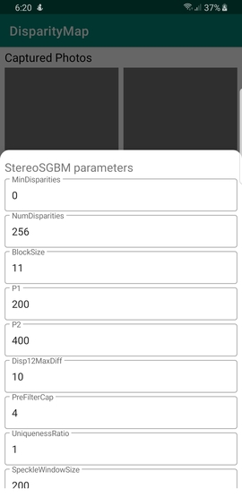

# Android Disparity Map

This is a *prototype* app that implements **OpenCV 3.4** to create a disparity map from two individually taken photographs in a single-camera smartphone.

**Features:**

- Uses StereoSGBM to calculate disparity
- Implements Homography correction using ORB
- Includes a menu for changing StereoSGBM parameters
- Applies WLS Filtering to disparity image to show a smooth disparity map

## Screenshots

